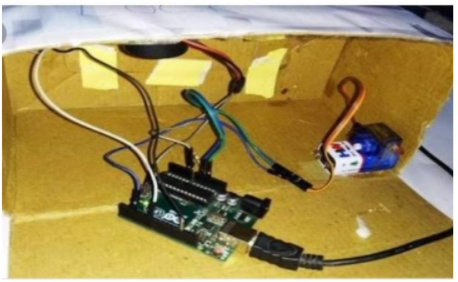

# Smart_locker_using_Arduino
Developed a real-time Smart door lock security system using Arduino.System works based on knock pattern.
Code will be found in the PDF attached above
<li>

<li>Components required
  <ul>1.Arduino Uno</ul>
 <ul>2.Buzzer</ul>
 <ul>3.1 MΩ Resistor</ul>
 <ul>4.Power</ul>
 <ul>5.Connecting wires</ul>
 <ul>6.Box</ul>
 <ul>7.Servo Motor</ul></li>
